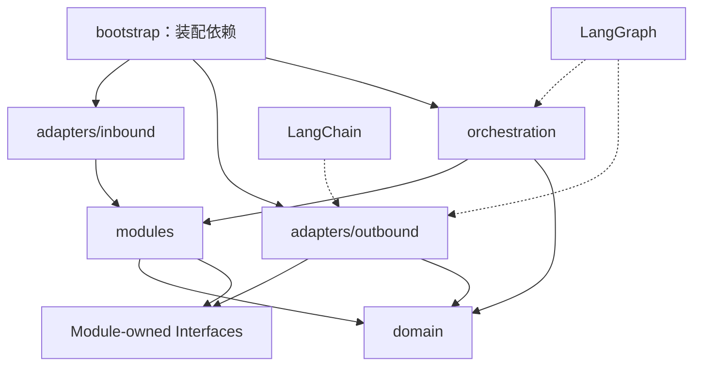
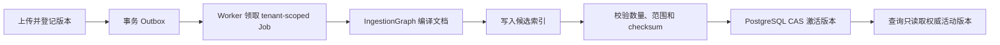
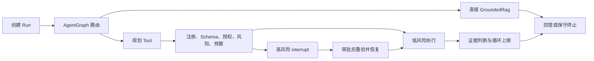

# `rag` 目标架构

## 1. 架构结论

新项目可以大量使用 LangChain 与 LangGraph 重写，但不能把完整能力等同于“全部交给框架”。

- **LangChain** 提供模型、Embedding、Prompt、结构化输出、Tool、Loader/Splitter 和 Retriever 等通用积木。
- **LangGraph** 提供有状态图编排、持久化、恢复、循环、流式事件和 Human-in-the-loop 机制。
- **本项目自研**领域模型、租户权限、文档结构与稳定身份、混合检索策略、证据与 Citation、
  跨存储生命周期一致性、可靠任务、安全 Tool 策略、评测门禁和高级知识算法。

框架是 Adapter，不是领域核心。新项目不会为适配框架而降低旧项目的能力语义。

## 2. 架构原则

1. **绿地实现**：新 Git 历史、新目录、新包名；旧项目不进入运行时依赖图。
2. **能力兼容优先**：内部结构允许完全变化，调用者可见行为必须由兼容测试保护。
3. **Deep Module**：每个 Module 用较小 Interface 隐藏较多 Implementation，避免大量透传层。
4. **领域依赖向内**：领域类型和策略不导入 FastAPI、LangChain、LangGraph、数据库或云 SDK。
5. **图只解决编排问题**：确定性的检索算法、权限判定和事务状态机不为了“统一”而图化。
6. **数据库保存事实**：PostgreSQL 是业务状态权威源；搜索、对象和队列是投影或传输设施。
7. **默认安全失败**：tenant、ACL、版本和删除状态不能被模型、Tool、fallback 或重试放宽。
8. **实验能力默认关闭**：旧项目仍未证明真实增益的能力，在新项目中保持关闭直至评测通过。

## 3. 运行时架构图

```mermaid
flowchart LR
    subgraph clients["调用方"]
        sdk["Web、SDK、CLI"]
        operator["运维与评测"]
    end

    subgraph entry["入口 Adapter"]
        api["FastAPI"]
        worker["Ingestion Worker"]
        maintainer["维护任务"]
    end

    subgraph modules["Deep Modules"]
        fixedRag["GroundedRag"]
        retrieval["AuthorizedRetrieval"]
        compiler["DocumentCompiler"]
        lifecycle["LifecycleCoordinator"]
        modelRuntime["ModelRuntime"]
        policies["CorePolicies"]
    end

    subgraph orchestration["LangGraph 编排"]
        ingestionGraph["IngestionGraph"]
        agentGraph["AgentGraph"]
        advancedGraph["AdvancedBuildGraph"]
    end

    subgraph adapters["出站 Adapter"]
        langchainAdapter["LangChain Adapter"]
        persistenceAdapter["PostgreSQL Adapter"]
        searchAdapter["Search Adapter"]
        objectAdapter["ObjectStore Adapter"]
        queueAdapter["Queue Adapter"]
        checkpointAdapter["LangGraph Checkpoint Adapter"]
    end

    subgraph data["基础设施"]
        postgres[("PostgreSQL")]
        search[("Elasticsearch 或 OpenSearch")]
        objectStore[("S3 或 MinIO")]
        queue[("Redis 或消息队列")]
    end

    subgraph external["模型 Provider"]
        llm["LLM、Embedding、Reranker、OCR、Vision、ASR"]
    end

    sdk --> api
    operator --> api
    operator --> maintainer
    api --> fixedRag
    api --> lifecycle
    api --> agentGraph
    worker --> ingestionGraph
    maintainer --> lifecycle
    maintainer --> advancedGraph

    fixedRag --> retrieval
    fixedRag --> modelRuntime
    agentGraph --> retrieval
    agentGraph --> modelRuntime
    ingestionGraph --> compiler
    ingestionGraph --> lifecycle
    ingestionGraph --> modelRuntime
    advancedGraph --> modelRuntime
    advancedGraph --> lifecycle
    retrieval --> policies
    lifecycle --> policies

    modelRuntime --> langchainAdapter
    compiler --> objectAdapter
    retrieval --> searchAdapter
    retrieval --> persistenceAdapter
    lifecycle --> persistenceAdapter
    lifecycle --> searchAdapter
    lifecycle --> objectAdapter
    lifecycle --> queueAdapter
    agentGraph --> checkpointAdapter

    persistenceAdapter --> postgres
    checkpointAdapter --> postgres
    searchAdapter --> search
    objectAdapter --> objectStore
    queueAdapter --> queue
    langchainAdapter --> llm
```



图中的 `IngestionGraph` 只编排解析分支、OCR/媒体处理、Embedding 和发布步骤；任务投递、
幂等、Outbox、CAS、dead-letter 与业务状态仍由自研 Module 负责。固定检索与生命周期事务
不创建 `RetrievalGraph` 或 `LifecycleGraph`。

## 4. 源码依赖图



强制规则：

- `domain` 不导入项目其他层或第三方框架。
- 每个出站 Interface 由使用它的 Module 拥有，Adapter 反向满足 Interface。
- LangChain 类型不得穿透到领域类型、HTTP Schema 或持久化 Schema。
- LangGraph State 是编排 DTO，不是业务事实源；可恢复状态必须引用持久化业务 ID。
- `bootstrap` 是唯一知道具体 Adapter 组合的位置。

## 5. 建议目录

```text
rag/
├─ pyproject.toml
├─ src/rag_platform/
│  ├─ domain/                     # 实体、值对象、不变量、领域错误和 Policy
│  ├─ modules/
│  │  ├─ model_runtime/           # 模型调用与配额的统一 Interface
│  │  ├─ document_compiler/       # 解析、规范化、Chunk、稳定身份
│  │  ├─ ingestion/               # Job 与摄取用例
│  │  ├─ retrieval/               # 授权混合检索与 Trace
│  │  ├─ grounded_rag/            # 答案、证据判定、Citation、流式
│  │  ├─ lifecycle/               # 版本、发布、删除、恢复、重建、对账
│  │  ├─ agent_runtime/           # Agent 治理 Interface
│  │  └─ advanced_knowledge/      # GraphRAG、RAPTOR、多模态、时序
│  ├─ orchestration/
│  │  ├─ ingestion_graph.py
│  │  ├─ agent_graph.py
│  │  └─ advanced_build_graph.py
│  ├─ adapters/
│  │  ├─ inbound/                 # FastAPI、Worker、CLI
│  │  └─ outbound/                # LangChain、Postgres、Search、S3、Queue、OCR
│  └─ bootstrap/                  # API、Worker、维护任务的 composition roots
├─ migrations/
├─ tests/
│  ├─ contract/                   # Module Interface 和 Adapter 契约
│  ├─ compatibility/              # 新旧黑盒兼容
│  ├─ integration/                # 真实基础设施
│  ├─ evaluation/                 # 检索、答案、Citation、Agent 质量
│  ├─ security/                   # tenant、ACL、Tool、注入、SSRF
│  └─ e2e/
├─ datasets/                      # 版本化、许可清晰的评测数据
└─ docs/
```

目录按领域能力组织，不复刻旧项目的 `knowledge/application/infrastructure` 等完整树形结构。

## 6. Deep Module 责任

| Module | 小 Interface 背后的责任 | 主要实现方式 |
|---|---|---|
| `CorePolicies` | 授权上下文、tenant/KB 范围、可见性、资源预算、错误分类 | 全自研，纯领域代码 |
| `ModelRuntime` | 模型注册、结构化调用、流式、Token/成本、超时、降级、审计 | LangChain 模型 Interface + 自研治理 |
| `DocumentCompiler` | MIME 路由、解析、统一 Block、OCR、Chunk、稳定 ID、来源映射 | 选择性 Loader/Splitter + 自研结构和策略 |
| `IngestionCoordinator` | Job、进度、取消、幂等、编译、索引候选、发布请求 | LangGraph 编排 + 自研可靠任务语义 |
| `AuthorizedRetrieval` | Query 变换、硬过滤、BM25/KNN、RRF、Rerank、清理、no-evidence、Trace | LangChain Adapter + 自研检索核心 |
| `GroundedRag` | Prompt、流式生成、证据充足性、拒答、Citation 校验 | LangChain Runnable + 自研证据策略 |
| `LifecycleCoordinator` | 不可变版本、CAS 激活、回滚、tombstone、Outbox、对账、重建 | 全自研；框架不得成为事实源 |
| `AgentRuntime` | 路由、循环、Tool、Checkpoint、HITL、Memory、Budget、恢复 | LangGraph + LangChain Tool + 自研治理 |
| `AdvancedKnowledgeBuilder` | 关键词/问题/摘要、GraphRAG、RAPTOR、多模态、时序 | LangGraph 编排 + 自研算法与 provenance |
| `CompatibilityHarness` | 旧 commit 固定、场景驱动、结果规范化、差异分类、门禁报告 | 全自研测试工具，不进入生产运行时 |

## 7. LangChain、LangGraph 与自研边界

| 功能 | LangChain | LangGraph | 自研结论 |
|---|---|---|---|
| LLM、Embedding、消息、Prompt、结构化输出 | 直接采用 | 不需要 | 自研 Provider 注册、配额、密钥和审计 |
| 通用 Loader、Text Splitter | 可选择采用 | 不需要 | 复杂 PDF/OCR、统一 Block、九类 Chunk 与稳定 ID 自研 |
| VectorStore/Retriever Interface | 可作 Adapter | 不需要 | 不能代替 ACL、混合融合、版本过滤、删除防御和 Trace |
| 固定 RAG | Runnable/Prompt/流式可直接采用 | 不采用图 | 证据判定、Citation 和 no-evidence 自研 |
| 摄取流程 | Loader/Embedding 可用 | 适合分支、恢复和事件流 | Queue、Outbox、幂等、CAS、发布和对账自研 |
| Agent 与 Tool | Tool/Agent 积木可用 | 直接承担有状态循环 | Tool 安全、授权、预算、审批业务记录自研 |
| Checkpoint/HITL | 不承担 | 直接采用持久化、interrupt/resume | tenant 绑定、版本兼容、审批 Policy 和幂等副作用自研 |
| 生命周期 | 不承担 | 不用图代替事务状态机 | 版本、删除、回滚、跨存储一致性全部自研 |
| GraphRAG/RAPTOR/时序/多模态 | 模型与 Prompt 可用 | 适合构建编排 | 数据模型、算法、版本、provenance、增益评测自研 |
| 安全、评测、部署 | Callback 只能辅助 | 事件只能辅助 | 必须自研并由 CI/运行平台负责 |

参考的官方能力范围：

- [LangChain Retrieval](https://docs.langchain.com/oss/python/langchain/retrieval)
- [LangChain Agents](https://docs.langchain.com/oss/python/langchain/agents)
- [LangGraph Persistence](https://docs.langchain.com/oss/python/langgraph/persistence)
- [LangGraph Durable execution](https://docs.langchain.com/oss/python/langgraph/durable-execution)
- [LangGraph Interrupts](https://docs.langchain.com/oss/python/langgraph/interrupts)

依赖版本在 R1/R2 锁定，文档不使用漂移的“latest”版本号作为实现契约。

## 8. 关键运行流程

### 8.1 文档摄取



### 8.2 授权检索与问答

```mermaid
flowchart LR
    request["可信 AuthorizationContext"] --> scope["构造不可放宽的硬范围"]
    scope --> retrieve["BM25 与 KNN 并行召回"]
    retrieve --> fuse["去重、RRF、Rerank、阈值"]
    fuse --> authority["活动版本与删除状态终检"]
    authority --> evidence["证据充足性判断"]
    evidence --> answer["生成答案或 no_evidence"]
    answer --> citations["校验 Citation 与来源"]
```



### 8.3 Agent



## 9. 数据与一致性

- PostgreSQL：KnowledgeBase、Document、DocumentVersion、Job、Operation、Outbox、审批、
  Trace 元数据和活动索引版本的权威源。
- 对象存储：原始文件和派生物；对象 key 必须 tenant-scoped，数据库保存引用和完整性 hash。
- 搜索引擎：可重建投影；每条记录携带 tenant、KB、DocumentVersion、index generation 和状态字段。
- Queue：传输，不保存业务事实；消息只携带最小 ID，由 Worker 从 PostgreSQL 重新加载并鉴权。
- LangGraph Checkpoint：Agent/Ingestion 编排恢复；不替代业务表、Outbox 或审计记录。

不使用跨存储 2PC。通过事务 Outbox、确定性 ID、幂等消费者、候选索引、CAS/fencing、
补偿和 reconciliation 保证最终一致，并始终以 PostgreSQL 活动版本过滤查询结果。

R6 已实现该边界的独立部署 Profile：Worker 直接租约消费 PostgreSQL Outbox，ObjectStore 使用
tenant-contained 文件系统，Search 使用 Elasticsearch。它们分别满足 MessageQueue、ObjectStore
与 Search Projection 的语义；后续替换为托管队列、S3/MinIO 或 OpenSearch 不改变 Module
Interface。R6 的完整状态机、失败语义和 API 见 [R6 执行记录](phases/r6-reliable-lifecycle.md)。

## 10. 架构验收条件

- 生产代码和依赖图中不存在旧项目包、旧仓库路径或旧运行时调用。
- Domain/Module Interface 不导入 LangChain/LangGraph 或具体基础设施类型。
- 只有三个 Graph：`IngestionGraph`、`AgentGraph`、`AdvancedBuildGraph`；新增 Graph 必须有分支、
  循环、暂停恢复或长时状态中的至少一项真实需求。
- 固定 RAG 与 KnowledgeBase Tool 共用唯一 `AuthorizedRetrieval` Interface。
- 所有知识查询先建立可信 `AuthorizationContext`，任何 fallback 都不能放宽硬范围。
- 兼容报告覆盖 CAP-01～CAP-43；旧项目已实现能力不得出现未批准回归，旧限制不得被虚假提升。
