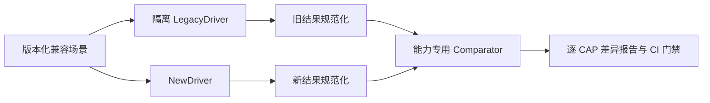

# 兼容测试与旧代码复用规则

## 1. 兼容性不是复制实现

新项目对旧项目承担的是能力和行为兼容，不是源码、目录或内部类型兼容。旧项目作为测试 oracle，
不作为依赖、submodule、运行时 fallback 或“临时 legacy Adapter”。



LegacyDriver 只在 R0/R10 兼容任务或需要诊断差异时运行。日常单元测试使用新项目自己的契约和
golden，避免把旧实现的偶然缺陷永久编码成新架构。

## 2. 比较等级

| 类型 | 适用对象 | 判定方式 |
|---|---|---|
| 精确相等 | ID 规范、状态、错误码、权限结果、no-evidence、幂等结果 | 规范化 JSON/事件序列完全一致 |
| 结构相等 | ParsedBlock、Chunk、Citation、Trace | 必需字段与不变量一致，允许新字段 |
| 集合/排序 | 检索候选 | ID 集合、Recall、MRR/NDCG、TopK 重叠与 tie 规则 |
| 数值容差 | 分数、延迟、Token/费用 | 按数据集和 Provider 固定阈值 |
| 语义质量 | 答案、摘要、实体、时序 | 固定数据集、确定性规则和人工抽审；与 Fake 分开 |
| 安全负向 | tenant、ACL、删除、Tool、SQL、SSRF | 必须同等或更严格；任何泄露立即阻断 |
| 状态轨迹 | 摄取、生命周期、Agent/HITL | 合法状态序列、终态、副作用和恢复结果 |

## 3. 差异分类

- `equivalent`：满足兼容 Comparator。
- `approved_improvement`：更严格安全、更稳定错误或质量提升；有 ADR 和回归测试。
- `preserved_limitation`：旧项目未验证/默认关闭/延期的能力在新项目保持相同状态。
- `regression`：已实现能力退化、行为丢失或安全变弱；阻断合并/发布。
- `not_comparable`：环境、Provider 或数据不足；不能视为通过，必须列入限制或补齐证据。

## 4. 旧代码复用决策

旧代码可以复用，但“技术上能复制”不等于“应该复制”。每个候选文件单独执行以下顺序：

1. **许可检查**：确认旧仓库许可证允许复用，并保留原始版权/许可要求。
2. **领域适配**：代码是否表达稳定算法，而不是耦合旧 ORM、全局配置、Web 框架或目录布局。
3. **架构检查**：复用后是否仍满足新 Module Interface 和依赖方向；禁止为了复用污染 Domain。
4. **质量检查**：类型、错误、资源限制、安全、确定性和测试是否达到新仓库标准。
5. **成本比较**：评估直接复用、改造复用、参考重写、全新实现四种方案。
6. **登记和测试**：通过后写入 `docs/reuse-register.yaml`，补契约/golden/安全测试，再导入最小代码。

### 允许优先评估

- 无第三方耦合的纯函数、确定性算法、格式规范化、测试数据生成器。
- 许可清晰且输出符合新领域契约的独立 Parser/Chunk 算法。
- 与业务无关的部署模板片段或观测配置，但必须重新验证默认安全值。

### 默认不复用

- 旧目录整体、旧 Git 历史、旧配置系统和 composition root。
- ORM 模型、Repository、HTTP Handler、全局单例、旧 Queue/Worker 运行时。
- 权限、生命周期、跨存储一致性、Agent Policy 和持久化状态机实现。
- 为旧 Schema 编写的 Adapter 或任何让新运行时依赖旧数据库的代码。
- 没有明确许可证、来源或测试的复制代码。

## 5. 复用登记 Schema

```yaml
- id: REUSE-001
  source_repository: haonanhu02-jpg/ragflow-agent
  source_commit: full_sha
  source_path: path/in/old/repo.py
  destination_path: src/rag_platform/...
  license_review: passed
  decision: direct_reuse | adapted_reuse | reference_rewrite | rejected
  rationale: why this is lower risk than a new implementation
  modifications: list of architectural and behavioral changes
  capabilities: [CAP-01]
  tests: [tests/contract/...]
  reviewer: name
  approved_at: YYYY-MM-DD
```

登记不存在或未批准时，CI 将扫描旧项目特征路径、包名和已知大段源码指纹并阻断。

## 6. 数据迁移边界

兼容性不要求新项目沿用旧数据库 Schema。R10 使用离线 `export-old` / `import-new` 工具完成：

1. 旧系统导出版本化、中立的交换格式和对象引用。
2. 新系统验证 tenant、ID、hash、状态和引用后写入新领域表。
3. 新系统独立重建搜索投影，不直接复制旧索引。
4. dry-run 给出数量、冲突、不可映射数据和预计资源。
5. 导入幂等；失败可清除本批新数据并恢复旧系统入口。

迁移工具属于发布工具，不进入在线请求路径，也不形成长期双写。

## 7. CI 门禁

- 每个 PR：lint、strict type、unit、Module contract、依赖方向、secret、许可/复用登记。
- 涉及对应能力：兼容场景、golden、安全负向、迁移 Schema 检查。
- 主分支定时：真实 PostgreSQL/Search/Object/Queue 集成、故障注入、真实 Provider 评测（有密钥时）。
- R10：全 CAP、全数据集、全迁移演练和发布报告。

所有报告必须区分 `passed`、`failed`、`skipped`、`not_comparable`；只有 `passed` 计入能力证据。
