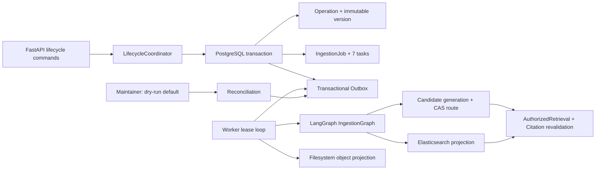

# R6 Reliable Ingestion and LifecycleCoordinator

R6 completes CAP-23 through CAP-26 and CAP-38 while preserving every R0–R5 contract. PostgreSQL is
the business authority; Elasticsearch and the filesystem object store are rebuildable projections.
LangGraph continues to order deterministic ingestion nodes, but it does not own command
idempotency, authorization, retry truth, version activation, deletion, or recovery.

## Runtime architecture

The request commits business intent and a deterministic message in one transaction. A Worker
claims the message with `FOR UPDATE SKIP LOCKED`, a named lease and a finite attempt budget.
Expired leases become visible to reconciliation. Projection writes are idempotent; generation
activation uses a PostgreSQL fencing token and compare-and-swap route, so a stale worker cannot
replace a newer generation.

## Lifecycle semantics

| Command | Authoritative commit | Asynchronous side effect | Visibility rule |
|---|---|---|---|
| Upload/update/reparse | immutable draft version, job, tasks, Outbox | compile, embed, project, validate, CAS activate | old active version serves until complete |
| Rollback | target version active, new generation built and route switched | bind target projection to new generation | fail closed until projection acknowledgement |
| Delete | document tombstone and active version `deleted` | Elasticsearch tombstone | invisible immediately through PostgreSQL final validation |
| Restore | retained deleted version active, purge deadline cleared | remove projection tombstone | visible after projection acknowledgement |
| Purge | due tombstone verified | remove ES rows, DB chunks/versions/jobs and source objects | only after retention deadline |
| KB rebuild | operation and expected fencing token | copy/validate candidate, CAS route, retain old generation | old generation serves until atomic switch |

Every operation has a tenant envelope, actor, reason, deterministic ID, idempotency fingerprint,
progress, attempt count, error classification and optional purge deadline. Reusing a key with
different semantic input, including its audit reason, is a conflict. Transient failures wait for
bounded retry; exhausted transient failures enter dead letter; permanent errors fail without retry.
Cancellation is checked between ingestion tasks. Failure acknowledgement is lease-owner fenced,
so an expired Worker cannot overwrite a newer delivery. A committed tombstone/restore/rollback
requires a compensating command rather than cancellation. Batches preserve the legacy bounded
concurrency field and reject children crossing actor, operation-kind or knowledge-base scope.

## Public API added in R6

- `PUT /v1/documents/{document_id}/content`
- `POST /v1/documents/{document_id}/reparse`
- `DELETE /v1/documents/{document_id}`
- `POST /v1/documents/{document_id}/restore`
- `POST /v1/documents/{document_id}/rollback`
- `POST /v1/knowledge-bases/{knowledge_base_id}/rebuild`
- `GET|POST /v1/lifecycle-operations/{operation_id}[ /cancel ]`
- `POST /v1/lifecycle-batches` and `GET /v1/lifecycle-batches/{batch_id}`

Trusted tenant and actor headers remain transport-authentication inputs, never body fields. Write
commands require owner, admin or editor and an `Idempotency-Key`; content update also records
`X-Lifecycle-Reason`.

## Recovery and evidence

Maintainer is dry-run unless explicitly launched with `--apply`. It inventories PostgreSQL,
filesystem objects and Elasticsearch projection versions. Safe automatic repairs return expired
Outbox leases to pending, schedule a deterministic purge for an expired tombstone, and remove only
objects or projection versions that have no authoritative PostgreSQL reference. Missing objects,
chunk-count drift, stale operations, missing/due Outbox messages and stale candidate generations
are reported for operator review and never guessed into a new business state.

Real PostgreSQL, Elasticsearch and filesystem tests cover update/reparse, failure preserving the
old active version, rollback generation construction, immediate deletion, restore, purge, rebuild,
Worker kill recovery, stale-worker fencing, duplicate delivery, cancellation, transient retry
exhaustion, dead letter, scoped batch aggregation/concurrency, cross-store orphan repair and
migration round trip. No legacy source was copied; the pinned repository was used only as
behavioral evidence.

R7 may wrap `AuthorizedRetrieval` as an Agent Tool and add durable Agent checkpointing. It must not
replace the lifecycle authority established here.
